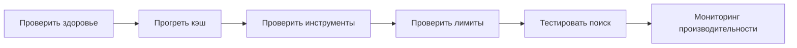

# 📮 Postman коллекция - Investment Data Stream Service API

## 🚀 Быстрый старт

### 1. Импорт коллекции

1. Откройте **Postman**
2. Нажмите **Import** (кнопка в левом верхнем углу)
3. Выберите файл `Investment_Data_Stream_Service_API.postman_collection.json`
4. Нажмите **Import**

### 2. Импорт переменных окружения

1. В Postman нажмите **Import**
2. Выберите файл `Investment_Data_Stream_Service_Environment.postman_environment.json`
3. Нажмите **Import**
4. Выберите окружение **Investment Data Stream Service Environment** в правом верхнем углу

### 3. Настройка переменных

Коллекция использует переменные окружения:

| Переменная | Значение по умолчанию | Описание |
|------------|----------------------|----------|
| `base_url` | `http://localhost:8084` | Базовый URL API сервера |
| `share_figi` | `BBG004S68758` | FIGI акции SBER для тестирования |
| `future_figi` | `FUTSBER03260` | FIGI фьючерса SBER для тестирования |
| `indicative_figi` | `TCS00A0JR514` | FIGI индикативного инструмента |
| `limits_figi` | `BBG004S68758` | FIGI для тестирования лимитов |
| `search_query` | `SBER` | Поисковый запрос |
| `cache_name` | `sharesCache` | Название кэша для тестирования |

---

## 📁 Структура коллекции

### 🏠 Health & Status
- **Application Health** - Проверка состояния приложения
- **Application Info** - Информация о приложении

### 📊 Instruments API
- **Shares** - Работа с акциями
  - Get All Shares - Получить все акции
  - Get Share by FIGI - Получить акцию по FIGI
- **Futures** - Работа с фьючерсами
  - Get All Futures - Получить все фьючерсы
  - Get Future by FIGI - Получить фьючерс по FIGI
- **Indicatives** - Работа с индикативными инструментами
  - Get All Indicatives - Получить все индикативные инструменты
  - Get Indicative by FIGI - Получить индикативный инструмент по FIGI
- **Search** - Поиск инструментов
  - Search Instruments - Поиск по тикеру или названию
- **Summary** - Сводная информация
  - Get Instruments Summary - Сводка по всем инструментам

### 📈 Limits API
- **Get Limits by FIGI** - Получить лимиты инструмента по FIGI
- **Get Shares Limits** - Получить лимиты всех акций
- **Get Futures Limits** - Получить лимиты всех фьючерсов
- **Get Limits Summary** - Сводная информация по лимитам
- **Get Limits Cache Stats** - Статистика кэша лимитов

### 🗄️ Cache Management
- **Warmup Cache** - Прогрев кэша инструментов и лимитов
- **Get Cache Content** - Получить содержимое кэша
- **Get Cache Content by Name** - Получить содержимое конкретного кэша
- **Get Cache Stats** - Получить статистику всех кэшей
- **Clear All Caches** - Очистить все кэши
- **Clear Cache by Name** - Очистить конкретный кэш

### 🕯️ Candles API
- **Start Candle Subscription** - Запустить подписку на свечи
- **Stop Candle Subscription** - Остановить подписку на свечи
- **Get Candle Subscription Status** - Получить статус подписки
- **Get Candle Subscription Stats** - Получить статистику подписки

### 📡 Streaming Service API
- **Start Streaming** - Запустить потоковый сервис данных
- **Stop Streaming** - Остановить потоковый сервис
- **Reconnect Streaming** - Переподключить потоковый сервис
- **Get Streaming Status** - Получить статус подключения
- **Get Streaming Stats** - Получить статистику сервиса
- **Get Streaming Health** - Получить состояние здоровья сервиса

### 🧪 Test Scenarios
- **Complete Workflow Test** - Полный тест рабочего процесса
- **Performance Test** - Тесты производительности

---

## 🎯 Основные сценарии

### Сценарий 1: Полная проверка системы

```
1. GET /actuator/health
   ✅ Приложение работает
   
2. POST /api/cache/warmup
   ✅ Кэш прогрет
   
3. GET /api/instruments/summary
   ✅ Инструменты загружены
   
4. GET /api/instruments/limits/cache-stats
   ✅ Лимиты в кэше
```

### Сценарий 2: Работа с инструментами

```
1. GET /api/instruments/shares
   ✅ Получить все акции
   
2. GET /api/instruments/shares/BBG004S68758
   ✅ Получить конкретную акцию
   
3. GET /api/instruments/search?q=SBER
   ✅ Поиск инструментов
```

### Сценарий 3: Работа с лимитами

```
1. GET /api/instruments/limits/summary
   ✅ Сводка по лимитам
   
2. GET /api/instruments/limits/shares
   ✅ Лимиты акций
   
3. GET /api/instruments/limits/BBG004S68758
   ✅ Лимиты конкретного инструмента
```

### Сценарий 4: Управление кэшем

```
1. GET /api/cache/stats
   ✅ Статистика кэша
   
2. POST /api/cache/warmup
   ✅ Прогрев кэша
   
3. DELETE /api/cache/clear
   ✅ Очистка кэша
```

---

## 🧪 Автоматические тесты

Коллекция включает автоматические тесты для каждого запроса:

### ✅ Базовые тесты
- Проверка статус кода (200 OK)
- Проверка структуры ответа
- Проверка обязательных полей
- Валидация типов данных

### ⚡ Тесты производительности
- Время ответа < 5 секунд для основных запросов
- Время ответа < 3 секунд для кэшированных данных

### 🔍 Тесты функциональности
- Проверка корректности данных
- Проверка работы кэша
- Проверка поиска

### Для запуска всех тестов:
1. Откройте **Collection Runner**
2. Выберите коллекцию **Investment Data Stream Service API**
3. Выберите окружение **Investment Data Stream Service Environment**
4. Нажмите **Run**

---

## 📊 Примеры ответов

### ✅ Успешный ответ инструментов

```json
{
  "success": true,
  "count": 169,
  "data": [
    {
      "figi": "BBG004S68758",
      "ticker": "SBER",
      "name": "Сбербанк",
      "currency": "RUB",
      "lot": 1,
      "minPriceIncrement": 0.01
    }
  ],
  "timestamp": "2024-10-26T23:12:00"
}
```

### ✅ Статистика лимитов

```json
{
  "success": true,
  "shares": {
    "withLimits": 169,
    "withoutLimits": 0,
    "total": 169
  },
  "futures": {
    "withLimits": 365,
    "withoutLimits": 0,
    "total": 365
  },
  "total": {
    "withLimits": 534,
    "withoutLimits": 0,
    "total": 534
  },
  "timestamp": "2024-10-26T23:12:00"
}
```

### ✅ Статистика кэша лимитов

```json
{
  "success": true,
  "cachedLimitsCount": 534,
  "cachedLimits": ["BBG004S68758", "FUTSBER03260", ...],
  "cacheStats": {
    "size": 534,
    "hitRate": 1.0,
    "missRate": 0.0,
    "requestCount": 0
  },
  "timestamp": "2024-10-26T23:12:00"
}
```

---

## 🔄 Типичный рабочий процесс



**Шаги:**

1. **Проверка:** `GET /actuator/health`
2. **Прогрев:** `POST /api/cache/warmup`
3. **Инструменты:** `GET /api/instruments/summary`
4. **Лимиты:** `GET /api/instruments/limits/summary`
5. **Поиск:** `GET /api/instruments/search?q=SBER`
6. **Мониторинг:** `GET /api/cache/stats`

---

## 🛠️ Переменные окружения

### TEST Environment (по умолчанию)
```
base_url = http://localhost:8084
share_figi = BBG004S68758
future_figi = FUTSBER03260
```

### PROD Environment
```
base_url = https://api.production.com
share_figi = BBG004S68758
future_figi = FUTSBER03260
```

Для переключения: **Environment Selector** (правый верхний угол Postman)

---

## 📝 Заметки

### Что происходит при прогреве кэша?

1. Загружаются все акции, фьючерсы и индикативные инструменты из БД
2. Загружаются лимиты для акций и фьючерсов из Tinkoff API
3. Все данные сохраняются в Caffeine кэш
4. Кэш готов для быстрого доступа

### Производительность

- **Время ответа:** < 100ms для кэшированных данных
- **Размер кэша:** ~534 лимита, ~591 инструмент
- **Hit Rate:** 100% для кэшированных запросов

### Мониторинг здоровья

**Нормальные значения:**
- `cachedLimitsCount` > 0 (лимиты в кэше)
- `hitRate` = 1.0 (100% попаданий в кэш)
- `responseTime` < 1000ms

**Проблемы:**
- `cachedLimitsCount` = 0 → Кэш пуст, нужен прогрев
- `hitRate` < 0.9 → Проблемы с кэшем
- `responseTime` > 5000ms → Проблемы с производительностью

---

## 🆘 Решение проблем

### Кэш пуст

**Причины:**
1. Приложение только запустилось
2. Кэш был очищен
3. Проблемы с загрузкой данных

**Решение:**
```bash
# 1. Прогреть кэш
POST /api/cache/warmup

# 2. Проверить статистику
GET /api/cache/stats

# 3. Проверить лимиты
GET /api/instruments/limits/cache-stats
```

### Медленные ответы

**Причины:**
1. Кэш не прогрет
2. Высокая нагрузка на сервер
3. Проблемы с БД

**Решение:**
1. Проверить кэш: `GET /api/cache/stats`
2. Прогреть кэш: `POST /api/cache/warmup`
3. Проверить логи приложения

### Ошибки 404

**Причины:**
1. Неправильный FIGI
2. Инструмент не найден в кэше
3. Кэш не прогрет

**Решение:**
1. Проверить правильность FIGI
2. Прогреть кэш: `POST /api/cache/warmup`
3. Поискать инструмент: `GET /api/instruments/search?q=TICKER`

---

## 📚 Дополнительные ресурсы

- **Swagger UI:** `http://localhost:8084/swagger-ui.html`
- **Actuator Health:** `http://localhost:8084/actuator/health`
- **Actuator Info:** `http://localhost:8084/actuator/info`
- **Actuator Metrics:** `http://localhost:8084/actuator/metrics`

---

## 🎯 Готовые тестовые сценарии

### 1. Complete Workflow Test
Полный тест рабочего процесса:
1. Проверка здоровья приложения
2. Прогрев кэша
3. Проверка загруженных инструментов
4. Проверка кэша лимитов
5. Тестирование поиска

### 2. Performance Test
Тесты производительности:
1. Load Test - Get All Shares
2. Load Test - Get All Futures
3. Load Test - Get Limits Summary

### 3. Manual Testing
Ручное тестирование отдельных функций:
1. Работа с акциями
2. Работа с фьючерсами
3. Работа с лимитами
4. Управление кэшем

---

**Версия:** 2.0  
**Дата:** 2024-10-26  
**Автор:** Investment Data Stream Service Team

## 🔧 Технические детали

### Поддерживаемые форматы
- **Content-Type:** `application/json`
- **Charset:** `UTF-8`

### Коды ответов
- **200 OK** - Успешный запрос
- **404 Not Found** - Ресурс не найден
- **500 Internal Server Error** - Ошибка сервера

### Лимиты
- **Максимальный размер ответа:** 10MB
- **Таймаут запроса:** 30 секунд
- **Размер кэша:** 10,000 записей

### Безопасность
- Все запросы используют HTTPS в продакшене
- Нет аутентификации для тестового окружения
- Логирование всех запросов для отладки