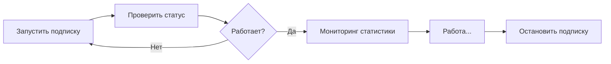

# 📮 Postman коллекция - Candles API

## 🚀 Быстрый старт

### 1. Импорт коллекции

1. Откройте **Postman**
2. Нажмите **Import** (кнопка в левом верхнем углу)
3. Выберите файл `Candles_API.postman_collection.json`
4. Нажмите **Import**

### 2. Настройка переменных

Коллекция использует переменную `{{base_url}}` со значением по умолчанию:
- `http://localhost:8080`

Для изменения:
1. Откройте коллекцию
2. Перейдите в **Variables**
3. Измените значение `base_url`

---

## 📁 Структура коллекции

### 1️⃣ Управление подпиской

| Метод | Endpoint | Описание |
|-------|----------|----------|
| POST | `/api/candles/subscription/start` | Запустить подписку на свечи |
| POST | `/api/candles/subscription/stop` | Остановить подписку |

### 2️⃣ Мониторинг

| Метод | Endpoint | Описание |
|-------|----------|----------|
| GET | `/api/candles/subscription/status` | Быстрая проверка статуса |
| GET | `/api/candles/subscription/stats` | Детальная статистика |

### 3️⃣ Сценарии использования

Готовый workflow: **Запуск → Мониторинг → Остановка**

---

## 🎯 Основные сценарии

### Сценарий 1: Запуск подписки на свечи

```
1. POST /api/candles/subscription/start
   ✅ Подписка запущена
   
2. GET /api/candles/subscription/status
   ✅ isRunning: true, isConnected: true
```

### Сценарий 2: Мониторинг работы

```
GET /api/candles/subscription/stats

Ответ:
{
  "success": true,
  "isRunning": true,
  "isConnected": true,
  "totalReceived": 15420,      ← Получено свечей
  "totalInserted": 15418,      ← Сохранено в БД
  "totalErrors": 2,            ← Ошибок
  "availableInserts": 185,     ← Доступно слотов
  "maxConcurrentInserts": 200, ← Макс. одновременно
  "insertUtilization": 0.075,  ← Утилизация 7.5%
  "errorRate": 0.00013        ← Ошибок 0.013%
}
```

### Сценарий 3: Остановка подписки

```
POST /api/candles/subscription/stop
✅ Подписка остановлена
```

---

## 🧪 Автоматические тесты

Коллекция включает автоматические тесты для каждого запроса:

- ✅ Проверка статус кода (200 OK)
- ✅ Проверка структуры ответа
- ✅ Проверка обязательных полей
- ✅ Валидация типов данных

Для запуска всех тестов:
1. Откройте **Collection Runner**
2. Выберите коллекцию **Candles API**
3. Нажмите **Run**

---

## 📊 Примеры ответов

### ✅ Успешный запуск

```json
{
  "success": true,
  "message": "Подписка на свечи успешно запущена",
  "timestamp": "2024-10-21T12:30:00"
}
```

### ❌ Подписка уже активна

```json
{
  "success": false,
  "error": "Подписка на свечи уже активна",
  "timestamp": "2024-10-21T12:30:00"
}
```

### 📈 Статистика

```json
{
  "success": true,
  "isRunning": true,
  "isConnected": true,
  "totalReceived": 15420,
  "totalInserted": 15418,
  "totalErrors": 2,
  "availableInserts": 185,
  "maxConcurrentInserts": 200,
  "insertUtilization": 0.075,
  "errorRate": 0.00013,
  "timestamp": "2024-10-21T12:33:00"
}
```

---

## 🔄 Типичный рабочий процесс



**Шаги:**

1. **Запуск:** `POST /subscription/start`
2. **Проверка:** `GET /subscription/status`
3. **Мониторинг:** `GET /subscription/stats` (периодически)
4. **Остановка:** `POST /subscription/stop`

---

## 🛠️ Переменные окружения

Создайте разные окружения для разных профилей:

### TEST Environment
```
base_url = http://localhost:8080
```

### PROD Environment
```
base_url = https://api.production.com
```

Для переключения: **Environment Selector** (правый верхний угол Postman)

---

## 📝 Заметки

### Что происходит при запуске подписки?

1. Загружаются все акции и фьючерсы из кэша
2. Создается подписка на минутные свечи для всех инструментов
3. Начинается получение данных в реальном времени
4. Для каждой свечи вычисляются технические показатели:
   - Тип свечи (BULLISH/BEARISH/DOJI)
   - Изменение цены и процент
   - Размер тела, тени
   - Диапазон цен, средняя цена
5. Свечи асинхронно сохраняются в таблицу `minute_candles`

### Производительность

- **Max одновременных вставок:** 200
- **Потоков обработки:** CPU cores × 4
- **Утилизация:** обычно 5-15% при нормальной нагрузке

### Мониторинг здоровья

**Нормальные значения:**
- `insertUtilization`: < 0.5 (< 50%)
- `errorRate`: < 0.01 (< 1%)
- `isConnected`: true

**Проблемы:**
- `insertUtilization` > 0.9 → Перегрузка, нужно больше потоков
- `errorRate` > 0.05 → Проблемы с БД или API
- `isConnected` = false → Потеряно соединение с API

---

## 🆘 Решение проблем

### Подписка не запускается

**Причины:**
1. Подписка уже запущена → Сначала остановите
2. Нет инструментов в кэше → Загрузите кэш
3. Проблемы с БД → Проверьте подключение

**Решение:**
```bash
# 1. Остановите подписку
POST /subscription/stop

# 2. Проверьте кэш
GET /api/cache/stats

# 3. Прогрейте кэш если нужно
POST /api/cache/warmup

# 4. Запустите снова
POST /subscription/start
```

### Высокий errorRate

**Причины:**
1. Проблемы с БД (медленные запросы, deadlocks)
2. Некорректные данные от API
3. Нехватка ресурсов

**Решение:**
1. Проверьте логи приложения
2. Проверьте нагрузку на БД
3. Увеличьте количество потоков

---

## 📚 Дополнительные ресурсы

- **Swagger UI:** `http://localhost:8080/swagger-ui.html`
- **Actuator Health:** `http://localhost:8080/actuator/health`
- **Metrics:** `http://localhost:8080/actuator/metrics`

---

**Версия:** 1.0  
**Дата:** 2024-10-21  
**Автор:** Investment Data Stream Service Team

